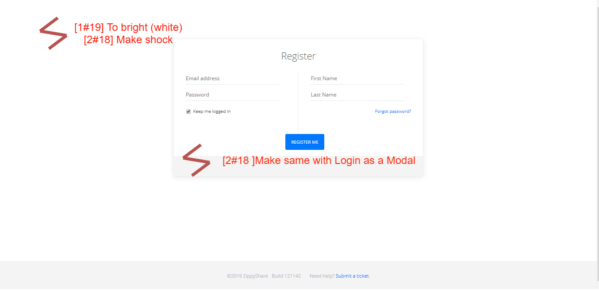
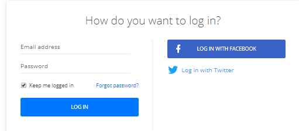
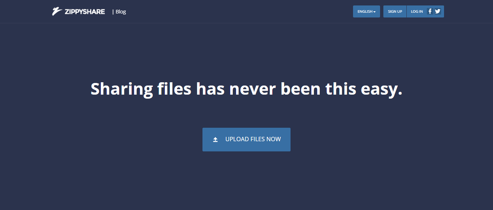
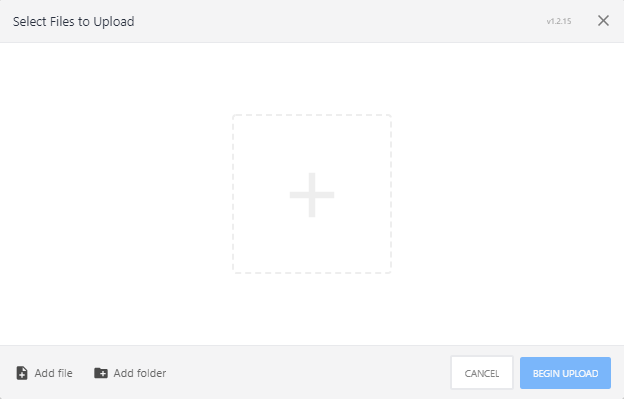
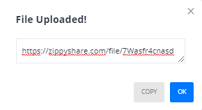
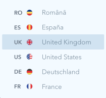

# Usability Evaluation and Prototyping (again)
> Usability Evaluation in this assignment is to evaluate your high-fidelity interactive-prototype with two participants:
> the participant from the previous Contextual Inquiry (CI) 
> and an additional novice-participant with different demographics if possible.
> Respectively, revise your prototype as an attempt to fix any problems found in this Usability Evaluation.

- [Usability Evaluation and Prototyping (again)](#usability-evaluation-and-prototyping-again)
  - [Operating the Prototype](#operating-the-prototype)
  - [Part A: Usability Evaluation](#part-a-usability-evaluation)
    - [1. Brief Description of Participants](#1-brief-description-of-participants)
      - [a. Description of Participant 1](#a-description-of-participant-1)
      - [b. Description of Participant 2](#b-description-of-participant-2)
    - [2. Evaluation Script](#2-evaluation-script)
    - [3. Transcript](#3-transcript)
      - [a. Transcript with Participant 1](#a-transcript-with-participant-1)
      - [b. Transcript with Participant 2](#b-transcript-with-participant-2)
    - [4. Feedback and Incidence Analysis](#4-feedback-and-incidence-analysis)
      - [OBSERVATION 1 (Register Page)](#observation-1-register-page)
      - [OBSERVATION 2 (Login Modal)](#observation-2-login-modal)
      - [OBSERVATION 3 (Home Page)](#observation-3-home-page)
      - [OBSERVATION 4 (File Upload)](#observation-4-file-upload)
      - [OBSERVATION 5 (Change Languange Modal)](#observation-5-change-languange-modal)
  - [Part B: Prototyping (again)](#part-b-prototyping-again)
    - [Sketch](#sketch)
    - [Design Rationale](#design-rationale)
    - [High-Fidelity Interactive-Prototype](#high-fidelity-interactive-prototype)

## Operating the Prototype
On this section, I've provided an video about operating a Hi-Fi Prototype (https://projects.invisionapp.com/share/8XR80O32YHF#/screens/355899099). Presenting the ideal case on how to interact with the prototype from the beginning to the end.

[Prototype Video](https://youtu.be/pfo2V4kgTY8)

---

## Part A: Usability Evaluation
> In this part, you should prepare your high-fidelity interactive-prototype from the assignment 2.
> Invite the participant from your previous CI to test the prototype.
> You also need to invite one more novice participant.
> As with the CI, you might need to videotape your sessions.
> You can benefit from the videotape while writing your `Recording Transcript` later.

### 1. Brief Description of Participants
> Describe your participants in bullets or sentences.
> The description should contain their demographic (age, gender, occupation),
> their skill level in using the system, and your reasons choosing them.
> The description should NOT contain any personally identifiable information.

#### a. Description of Participant 1
 - The user is a female student of Business Management Department ITS.
 - She has experience using a computer as she was do a homework.
 - In her college assigment she used a website to login and do a homework or logout, but not too often.
 - She rarely using file-sharing, the only file-sharing she knows is Google Drive, and she absolutely doesnt know about Zippyshare.

#### b. Description of Participant 2
 - The user is a male student of Biomedical Department ITS
 - He has experience using a computer
 - He often using file-sharing website for downloading game or movie.

### 2. Evaluation Script
On this section, it will countain spesific instruction given to user. Bellow is the following instruction.
1. Find out what ZippyShare is.
2. Try Changing the Language to United States or other Language (no really change languange of prototype).
3. Try to Register into the ZippyShare from current page.
4. Try Login to ZippyShare.
5. Try to upload file
6. How do you feel

### 3. Transcript
On this section, it will contain transcript during usability evaluation. Bellow is the following transcript.

#### a. Transcript with Participant 1
> **Y** => **You** \
> **P** => **Participant**

 1. **Y**: Hai \**cencored*\*, kemaren terima kasih untuk wawancara sebelumnya, sekarang mau minta bantuan mu lagi untuk wawancara lagi, sekarang mirip mirip dengan sebelumnya, cuma sudah dengan ui yang lumayan baru.
 2. **P**: Oke shiapp.
 3. **Y**: Sama seperti kemarin, pakai *Zippyshare*, tetapi menggunakan prototype yang sudah saya design sebelumnya, sekarang coba buka prototypenya dengan URL ini => https://projects.invisionapp.com/share/8XR80O32YHF#/screens/355899099
 4. **P**: Oke sebentar.
 5. **Y**: Sudah? sekarang coba cari tahu apa itu Zippyshare, apapun yang kamu ketahui dari *home page* tersebut.\
 (Setelah sekitar 2 menit)
 6. **P**: Ya karena sebuah website file sharing yang memudahkan dalam mengeshare sebuah file.
 7. **Y**: Oke, bagaimana menurutmu dengan *home page* tersebut ?
 8. **P**: Yaaa bagus bagus saja, better dari kemaren sih.
 9. **Y**: Sipsip, wkwkwk lanjut ya, temukan fitur ganti bahasa, contoh dari bahasa Inggris (UK) ke Inggris (US).
 10. **P**: Okee wait.\
 (Setelah sekitar 1 menit, **P** bisa menemukan fitur yang dimaksud)
 11. **P**: Syudahh.
 12. **Y**: Oke, sekarang bagaimana menurutmu dengan fitur tersebut ? apakah sudah jelas ?
 13. **P**: Sudah jelas sih, secara keseluruhan bagus saja, sudah sesuai intuisi juga bagiku, cuma belum dicoba ke bahasa yang lain.
 14. **Y**: Oke sip, untuk bahasa lain belum diimplementasikan ke secara benar sih karena memang masih cuma prototype. Menurutmu bagaimana dengan peletakan dan lain lain ?
 15. **P**: Siplah. 
 16. **Y**: Oke, lanjut, sekarang coba untuk register dan login ke dalam website, tapi gausah isi username dan password mu pada web Zippyshare sebenarnya, langsung submit saja bisa.
 17. **P**: Okee wait..
 (Setelah sekitar 2 menit, **P** mencoba kedua fitur register dan login)
 18. **Y**: Sip, bagaimana tentang kedua fitur tersebut ?
 19. **P**: Pertama sempat bingung sih karena gausah diisi kolomnya, terus registernya putih semua jadi kaget gitu tiba tiba terang, tetapi secara alur nya bagus.
 20. **Y**: Oke sip, ada saran lain ?
 21. **P**: Kalau saran sih, kan register jadi besar gitu sementara login kecil banget kotakannya, disamakan antara register dan login biar baguss gitu.
 22. **Y**: Oke, saran yang bermanfaat, sekarang lanjut untuk upload file ke Zippyshare, tapi gausah upload file beneran, karena belum bisa, langsung tombol sama seperti login.
 23. **P**: Oke wait...
 (Setelah sekitar 3 menit, **P** mencoba fitur tersebut)
 24. **Y**: Bagaimana ?
 25. **P**: Yaa lumayan sih, tapi gabisa upload file beneran :(.
 26. **Y**: Kalau feedbacknya gimana ?
 27. **P**: Yaa bagus sih, saya sukaa kaya langsung gitu.
 28. **Y**: Oke mantab. Bagaimana keseluruhan ?
 29. **P**: Overall bagus sih.
 30. **Y**: Oke sip, sudah selesaii, terima kasih.
 31. **P**: Sama sama.

#### b. Transcript with Participant 2
> **Y** => **You** \
> **P** => **Participant**

 1. **Y**: Hai \**cencored*\*, jadi kamu kan sudah terbiasa dengan file-sharing system seperti Zippyshare sebelumnya, maupun Google Drive untuk mendownload game, sekarang saya sudah menyediakan prototype Zippyshare yang mungkin baru, jadi ingin menanyai tentang pendapat saja sih tentang website ini, dalam bentuk wawancara sih ini.
 2. **P**: Yawes ndang
 3. **Y**: Hahaha, oke mulai ya sekarang coba buka prototypenya dengan URL ini => https://projects.invisionapp.com/share/8XR80O32YHF#/screens/355899099
 4. **P**: Oke sebentar.
 5. **Y**: Kalau sudah coba cari tahu apa itu Zippyshare, apapun yang kamu ketahui dari *home page* tersebut.\
 (Setelah sekitar 1 menit)
 6. **P**: Ya sesuai dengan yang tertulis "*Sharing files has never been this easy*".
 7. **Y**: Oke deh, terus bagaimana menurutmu dengan *home page* tersebut pada Zippyshare tersebut ?
 8. **P**: Kalau aku sih bagus bagus saja, emang gabisa desain soalnya
 9. **Y**: Hahaha oke, lanjut ya, sekarang coba ganti bahasa, contoh dari bahasa Inggris (UK) ke Inggris (US).
 10. **P**: Hmmmm, \
 (Setelah sekitar 1 menit, **P** bisa menemukan fitur yang dimaksud)
 11. **P**: Dah ketemu dan kuganti nih.
 12. **Y**: Sip deh, sekarang bagaimana menurutmu dengan fitur tersebut ? apakah sudah jelas ?
 13. **P**: Bagus bagus saja sih, kelihatan banget bahkan.
 14. **Y**: Benar juga, lanjut, sekarang coba untuk register dan login ke dalam website zippyshare, tapi gausah isi username dan password mu pada web Zippyshare sebenarnya, langsung submit saja bisa.
 15. **P**: Sebentarr
 (Setelah sekitar 1 menit, **P** mencoba kedua fitur register dan login)
 16. **P**: Sudah nih, cuma klik klik aja kan
 17. **Y**: Yaa..., menurutmu bagaimana tentang kedua fitur tersebut ?
 18. **P**: Kalau boleh kasih saran nih, registernya dibuat kaya login saja biar ga bingung, tadi sempet kaya shock gitu pas register.
 19. **Y**: Oke makasih atas sarannyaa, sekarang lanjut ya, coba in upload file ke Zippyshare, tapi gausah upload file beneran, karena belum bisa, langsung tombol sama seperti login.
 20. **P**: Oke
 (Setelah sekitar 2 menit, **P** mencoba fitur tersebut)
 21. **P**: Sudah nih.
 22. **Y**: Bagaimana menurutmu ?
 23. **P**: Yaa lumayan sih kalau jadi bagus, mirip mirip Google Drive menurutkuu, overall bagusslah.
 24. **Y**: Oke mantab. Bagaimana keseluruhan websitenya ?
 25. **P**: Dibilangi overall bagus kok haha.
 26. **Y**: Sip selesai, terima kasih banyak.
 27. **P**: Sama sama juga semoga bermanfaat.

### 4. Feedback and Incidence Analysis
> Record your observations per prototype screen followed by reference, feedback, incidence, reason, and resolution.

#### OBSERVATION 1 (Register Page)

 - **Reference**: 
   - [1#19] : First participant with number 19 dialog \
      "Pertama sempat bingung sih karena gausah diisi kolomnya, terus registernya putih semua jadi kaget gitu tiba tiba terang, tetapi secara alur nya bagus."
   - [2#18] : Second participant with number 18 dialog \
      "Kalau boleh kasih saran nih, registernya dibuat kaya login saja biar ga bingung, tadi sempet kaya shock gitu pas register."
 - **Feedback**: [2#18] Make Register feature using modal same as Login feature
 - **Incidence**: 
   - [1#19] Make participant surprised.
   - [2#18] Make participant shocked.
 - **Reason**: 
   - [1#19] Homepage have a dark colors, and register have a very bright colors and make participant surprised.
   - [2#18] Make participant shocked because register feature have different size from login feature.
 - **Resolution**: **Using** suggestion from participant #2
   - [2#18] Make Register feature using modal same as Login feature 
 
#### OBSERVATION 2 (Login Modal)

 - **Reference**: 
   - [1#21] : First participant with number 21 dialog \
    "Kalau saran sih, kan register jadi besar gitu sementara login kecil banget kotakannya, disamakan antara register dan login biar baguss gitu."
 - **Feedback**: [1#21] Login feature is good
 - **Incidence**: None
 - **Reason**: None
 - **Resolution**: None
 
#### OBSERVATION 3 (Home Page)

 - **Reference**:  
  - [1#8] : First participant with number 8 dialog \
    "Yaaa bagus bagus saja, better dari kemaren sih."
  - [2#8] : Second participant with number 8 dialog \
    "Kalau aku sih bagus bagus saja, emang gabisa desain soalnya"
 - **Feedback**: [1#8] and [2#8] The feature is good
 - **Incidence**: None
 - **Reason**: None
 - **Resolution**: None

#### OBSERVATION 4 (File Upload)

 - **Reference**:  
  - [1#25] : First participant with number 25 dialog \
    "Yaa lumayan sih, tapi gabisa upload file beneran :(."
  - [2#23] : Second participant with number 23 dialog \
    "Yaa lumayan sih kalau jadi bagus, mirip mirip Google Drive menurutkuu, overall bagusslah."
 - **Feedback**: [1#25] and [2#23] The feature is good
 - **Incidence**: None
 - **Reason**: None
 - **Resolution**: None

#### OBSERVATION 5 (Change Languange Modal)

 - **Reference**:  
  - [1#13] : First participant with number 13 dialog \
    "Sudah jelas sih, secara keseluruhan bagus saja, sudah sesuai intuisi juga bagiku, cuma belum dicoba ke bahasa yang lain."
  - [2#13] : Second participant with number 13 dialog \
    "Bagus bagus saja sih, kelihatan banget bahkan"
 - **Feedback**: [1#13] and [2#13] The feature is good
 - **Incidence**: None
 - **Reason**: None
 - **Resolution**: None

 ---

## Part B: Prototyping (again)
> Next, you will need to modify your prototype 
> based on the resolutions you have suggested in `Feedback and Incidence Analysis`'s observations.

### Sketch
> Draw a sketch of your prototype that is refined based according to the aforementioned observations on a paper.
> Afterwards, scan the sketch or make the photograph of it and attach it on this report's section.
> Please make sure the any texts on the sketch are readable.

### Design Rationale
> Please write a paragraph expressing what you have learned from the usability evaluation, 
> and how it is reflected in your design.

### High-Fidelity Interactive-Prototype
> Create a high-fidelity interactive-prototype based on the `Sketch` you have drawn.
> You can use any prototyping tools: InVision, Adobe XD, or even Microsoft PowerPoint.
